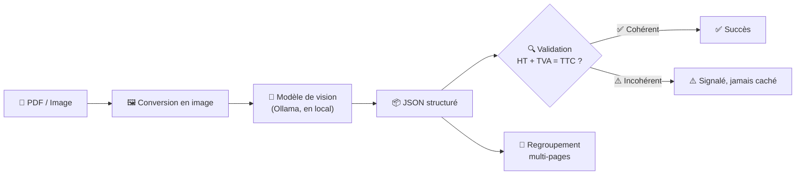

<div align="center">

# 🧾 Invoice OCR — Pipeline LLM Vision en Local

### Extraction structurée de factures, propulsée par un modèle de vision qui tourne 100% en local — aucune donnée ne quitte la machine.


</div>

---

## 📖 Sommaire

- [✨ Vue d'ensemble](#-vue-densemble)
- [🔄 Comment ça marche](#-comment-ça-marche)
- [🚀 Démarrage rapide (Docker)](#-démarrage-rapide-docker)
- [📌 Workflow Git — pas à pas](#-workflow-git--pas-à-pas)
- [🏢 Déploiement en entreprise — étape par étape](#-déploiement-en-entreprise--étape-par-étape)
- [🔧 Dépannage](#-dépannage)
- [⚙️ Configuration](#️-configuration)
- [⚠️ Limites connues](#️-limites-connues)
- [📁 Structure du projet](#-structure-du-projet)

---

## ✨ Vue d'ensemble

Ce projet lit une facture — un **PDF** ou une simple **image** (`png`, `jpg`, `webp`, `bmp`, `tiff`) — et renvoie des données structurées et propres : numéro de facture, date, fournisseur, client, devise, totaux **HT / TVA / TTC**, et lignes de détail.

Tout tourne **100% en local** via [Ollama](https://ollama.com) : pas d'API externe, aucune donnée n'est envoyée sur internet.

> 💡 **Pas besoin d'être développeur pour lire ce README.** Chaque commande est expliquée en langage simple juste en dessous — pas seulement listée.

---

## 🔄 Comment ça marche



1. On envoie un PDF ou une image à l'API
2. Les pages PDF sont converties en images ; les images seules sont normalisées en PNG
3. Chaque page est envoyée à un modèle de vision local (`qwen2.5vl:3b` par défaut) via Ollama
4. Le résultat est **validé** (HT + TVA = TTC, somme des lignes = HT) — toute incohérence est signalée, jamais cachée
5. Les pages appartenant à la même facture sont **regroupées automatiquement**

---

## 🚀 Démarrage rapide (Docker)

```bash
docker compose up --build -d
docker compose exec ollama ollama pull qwen2.5vl:3b
```

L'API est disponible sur **`http://localhost:8000`** 🎉

> 🎮 **GPU NVIDIA disponible ?** Décommenter le bloc `deploy` dans `docker-compose.yml` avant de construire (nécessite `nvidia-container-toolkit` sur la machine).

---

## 📌 Workflow Git — pas à pas

> Cette section explique quoi faire **à chaque fois** qu'un changement est fait, ou pour récupérer le projet sur une nouvelle machine. Aucune connaissance de Git n'est supposée.

### 1️⃣ J'ai modifié quelque chose sur mon laptop (même une seule ligne)

Un changement fait sur son laptop n'est **visible nulle part ailleurs** tant qu'il n'est pas envoyé sur GitHub. Pour l'envoyer :

```bash
git add .
git commit -m "décrire ce qui a changé"
git push
```

| Commande | Ce qu'elle fait, en langage simple |
|---|---|
| `git add .` | Prépare **tous** les fichiers modifiés dans le dossier pour être sauvegardés |
| `git commit -m "..."` | Crée un instantané de ces changements, avec une courte description (obligatoire, même une phrase) |
| `git push` | Envoie cet instantané sur GitHub, pour que tout le monde (et toute autre machine) puisse le voir |

Ces 3 commandes se lancent **depuis le dossier du projet**, toujours dans cet ordre — même pour une toute petite modification.

### 2️⃣ Récupérer le projet sur une machine qui ne l'a jamais eu (ex: au bureau)

```bash
git clone https://github.com/Nis011/invoicesOCR.git
cd invoicesOCR
```

Cela télécharge **tout le projet d'un coup**, dans un nouveau dossier créé automatiquement. Pas besoin de clé USB, pas besoin de copier-coller des fichiers un par un.

### 3️⃣ Le projet est déjà cloné là-bas, mais des changements ont eu lieu depuis

Se placer dans le dossier déjà cloné, puis :

```bash
git pull
```

Cela met à jour les fichiers locaux avec la dernière version poussée sur GitHub, sans tout re-télécharger.

### 📋 Résumé rapide

| Situation | Que faire |
|---|---|
| J'ai modifié le code | `git add .` → `git commit -m "..."` → `git push` |
| Je veux le projet sur une machine qui ne l'a jamais eu | `git clone https://github.com/Nis011/invoicesOCR.git` |
| Le projet est déjà là, mais pas à jour | `git pull` |

> ⚠️ Le dépôt est **privé**. Si l'IT ou un superviseur doit faire le `git clone` lui-même sans passer par elle, il faut d'abord l'ajouter comme collaborateur dans **Settings → Collaborators** sur GitHub.

---

## 🏢 Déploiement en entreprise — étape par étape

> À suivre dans l'ordre, une fois sur place, avec accès à la machine de l'entreprise.

### ✅ Avant de partir (checklist)

S'assurer que tout est bien poussé sur GitHub (voir section Git ci-dessus). Le projet doit contenir :
- `Dockerfile`
- `docker-compose.yml`
- `requirements.txt`
- `scripts/main.py`

### Étape 1 — Vérifier que Docker est installé

```bash
docker --version
```
- Une version s'affiche → Docker est prêt, passer à l'étape 2.
- Erreur → Docker n'est pas installé. Probablement une tâche pour l'équipe IT (pas à faire soi-même sans droits admin). À vérifier **avant** le jour J si possible.

### Étape 2 — Récupérer le projet sur place

**Méthode principale : GitHub** (voir section Workflow Git ci-dessus)
```bash
git clone https://github.com/Nis011/invoicesOCR.git
cd invoicesOCR
```

**Méthode de secours : clé USB** (si pas d'accès internet sur place)
1. Brancher la clé USB
2. Copier le dossier du projet vers un emplacement local
3. Ouvrir un terminal et s'y placer : `cd chemin\vers\le\dossier`

### Étape 3 — Vérifier si un GPU NVIDIA est disponible

C'est **la question la plus importante** — c'est ce qui détermine si l'extraction sera enfin rapide.

```bash
nvidia-smi
```
- Des infos sur une carte GPU s'affichent → il y a bien un GPU NVIDIA.
- Vérifier ensuite que Docker peut l'utiliser (nécessite `nvidia-container-toolkit` — à vérifier avec l'IT).

**Si un GPU est disponible**, ouvrir `docker-compose.yml` et décommenter (enlever les `#`) :
```yaml
deploy:
  resources:
    reservations:
      devices:
        - driver: nvidia
          count: 1
          capabilities: [gpu]
```

**Si pas de GPU ou pas sûr** → laisser commenté, ça fonctionnera quand même (juste plus lentement, en CPU).

### Étape 4 — Construire et lancer les conteneurs

```bash
docker compose up --build -d
```
- `-d` = tourne en arrière-plan.
- Peut prendre quelques minutes la première fois.

Vérifier que tout tourne :
```bash
docker compose ps
```
Deux conteneurs doivent apparaître : `app` et `ollama`, tous les deux "Up".

### Étape 5 — Télécharger le modèle

```bash
docker compose exec ollama ollama pull qwen2.5vl:3b
```

Optionnel, pour comparer avec le modèle 7b :
```bash
docker compose exec ollama ollama pull qwen2.5vl:7b
```

### Étape 6 — Vérifier que le GPU est vraiment utilisé

```bash
docker compose exec ollama ollama ps
```
- GPU activé correctement → colonne PROCESSOR proche de **100% GPU**.
- Toujours un pourcentage CPU élevé malgré le GPU décommenté → problème de configuration NVIDIA/Docker, à remonter à l'IT.

### Étape 7 — Tester avec Postman

```
POST http://localhost:8000/extract-invoice
```

À tester, dans l'ordre :
1. Une facture simple
2. Une facture avec des montants au format français (espace = milliers, virgule = décimales)
3. Un ticket de caisse avec double total (cas connu, voir Limites connues)
4. Un PDF multi-pages / multi-factures

→ Vérifier que les résultats correspondent à ce qui fonctionnait déjà, et comparer `request_total_seconds` dans la réponse — ça devrait être nettement plus rapide si le GPU est bien utilisé.

### Pour arrêter proprement à la fin

```bash
docker compose down
```
(les modèles téléchargés restent sauvegardés pour la prochaine fois — ajouter `-v` uniquement pour tout supprimer, y compris les modèles)

---

## 🔧 Dépannage

| Problème | Cause probable |
|---|---|
| `docker compose up` échoue | Docker pas installé/pas lancé sur la machine |
| Erreur "connection refused" vers Ollama | Le conteneur `app` n'a pas été reconstruit après un changement de code → `docker compose down` puis `docker compose up --build` |
| `ollama ps` montre toujours du CPU malgré le GPU décommenté | `nvidia-container-toolkit` probablement manquant — à vérifier avec l'IT |
| Les modèles ont disparu après un redémarrage | Ne devrait pas arriver (stockés dans un volume Docker persistant) — sinon, les re-télécharger (étape 5) |

---

## ⚙️ Configuration

| Variable | Où | Défaut | À quoi ça sert |
|---|---|---|---|
| `OLLAMA_URL` | variable d'env. | `http://localhost:11434/api/generate` | Où joindre Ollama |
| `OLLAMA_MODEL` | variable d'env. | `qwen2.5vl:3b` | Quel modèle utiliser |
| `MAX_CONCURRENT_PAGES` | `main.py` | `3` | Pages envoyées à Ollama en même temps |
| `IMAGE_ZOOM_FACTOR` | `main.py` | `2` | Résolution de rendu PDF (↑ = plus net, ↓ = plus rapide) |
| `MAX_ATTEMPTS_PER_PAGE` | `main.py` | `2` | Nombre de tentatives par page en cas d'échec |

---

## ⚠️ Limites connues

> 🧾 Sur certains documents avec **deux totaux visuellement similaires** (ex: un ticket de caisse avec une ligne "TOTAL" générale + un tableau de répartition H.T/TVA/TTC séparé), le modèle peut parfois se tromper sur `montant_ht`.
>
> ✅ **Ceci est détecté, pas caché** — la validation signale l'incohérence au lieu de renvoyer silencieusement une donnée fausse.

- 🐢 La vitesse d'extraction dépend du matériel — sur un GPU avec peu de VRAM, le modèle peut partiellement tourner sur le CPU, ce qui ralentit surtout les factures avec beaucoup de lignes.

---

## 📁 Structure du projet

```
📦 scripts/main.py     → l'API
📂 invoices/           → factures de test
📓 notebooks/          → notebooks d'exploration (OCR, tests du modèle de vision)
🐳 Dockerfile, docker-compose.yml
```

---

<div align="center">

Fait avec 🧠 de l'IA locale, ☕ de la patience, et beaucoup de débogage de tickets de caisse.

</div>
