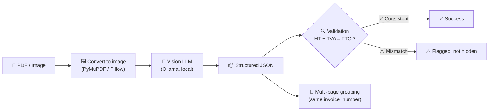

<div align="center">

# 🧾 Invoice OCR — Local Vision LLM Pipeline

### Structured invoice extraction, powered entirely by a local vision-language model — no data ever leaves the machine.


</div>

---

## ✨ Overview

This project reads an invoice — a **PDF** or a plain **image** (`png`, `jpg`, `webp`, `bmp`, `tiff`) — and returns clean, structured JSON: invoice number, date, supplier, client, currency, **HT / TVA / TTC** totals, and line items. Everything runs **100% locally** via [Ollama](https://ollama.com): no external API, no data ever leaves the machine.

<div align="center">

| 📄 Any format in | 🧠 Vision LLM reads it | ✅ Validated JSON out |
|:---:|:---:|:---:|
| PDF, PNG, JPG, WEBP... | `qwen2.5vl` via Ollama | HT + TVA = TTC checked |

</div>

---

## 🔄 How it works



1. **Upload** a PDF or image to the API
2. PDF pages → images (**PyMuPDF**); standalone images → normalized PNG (**Pillow**)
3. Each page → a local vision model (default: `qwen2.5vl:3b`) via **Ollama**, with a prompt that forces structured JSON
4. **Validated** for internal consistency (HT + TVA = TTC, line items sum to HT) — inconsistencies are flagged, never silently trusted
5. Pages belonging to the same invoice are **automatically grouped** together

---

## 🚀 Quick start (Docker — recommended)

```bash
docker compose up --build -d
docker compose exec ollama ollama pull qwen2.5vl:3b
```

The API is now live at **`http://localhost:8000`** 🎉

> 🎮 **Got an NVIDIA GPU?** Uncomment the `deploy` block in `docker-compose.yml` before building, for GPU-accelerated inference (requires `nvidia-container-toolkit` on the host).

<details>
<summary>🐍 Running without Docker</summary>

```bash
pip install -r requirements.txt
cd scripts
uvicorn main:app --reload
```

Requires [Ollama](https://ollama.com) installed and running locally, with a model pulled (`ollama pull qwen2.5vl:3b`).
</details>

---

## 📡 Usage

```http
POST http://localhost:8000/extract-invoice
```
`form-data` → key `file` → the PDF/image to extract.

<details>
<summary>📋 Example response (click to expand)</summary>

```json
{
  "status": "success",
  "total_pages": 1,
  "total_invoices": 1,
  "invoices": [
    {
      "data": {
        "invoice_number": "F20250511131",
        "supplier": "Damanesign SA",
        "montant_ht": 800.0,
        "tva": 160.0,
        "montant_ttc": 960.0,
        "line_items": [ { "description": "...", "total": 800.0 } ]
      },
      "validation": { "passed": true, "errors": [] }
    }
  ]
}
```
</details>

---

## ⚙️ Configuration

| Variable | Where | Default | Purpose |
|---|---|---|---|
| `OLLAMA_URL` | env var | `http://localhost:11434/api/generate` | Where to reach Ollama |
| `OLLAMA_MODEL` | env var | `qwen2.5vl:3b` | Which model to use |
| `MAX_CONCURRENT_PAGES` | `main.py` | `3` | Pages sent to Ollama at once |
| `IMAGE_ZOOM_FACTOR` | `main.py` | `2` | PDF render resolution (↑ sharper, ↓ faster) |
| `MAX_ATTEMPTS_PER_PAGE` | `main.py` | `2` | Retries per page on failure |

---

## ⚠️ Known limitations

> 🧾 On documents with **two visually similar totals** (e.g. a receipt with a standalone "TOTAL" line *and* a separate H.T/TVA/TTC breakdown table), the model can occasionally pick the wrong one for `montant_ht`.
>
> ✅ **This is caught, not hidden** — validation flags the mismatch instead of silently returning bad data.

- 🐢 Extraction speed is hardware-dependent — on limited-VRAM GPUs, the model may partially fall back to CPU, especially noticeable on invoices with many line items.

---

## 📁 Project structure

```
📦 scripts/main.py     → the API
📂 invoices/           → sample test invoices
📓 notebooks/          → exploration notebooks (OCR & vision model experiments)
🐳 Dockerfile, docker-compose.yml
```

---

<div align="center">

Built with 🧠 local AI, ☕ patience, and a lot of receipt debugging.

</div>
